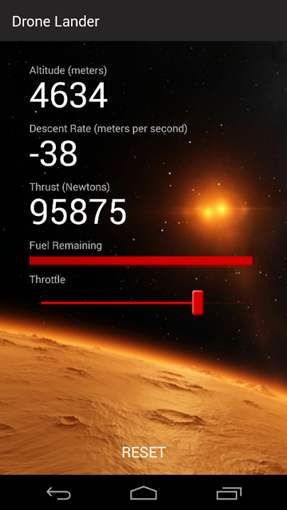
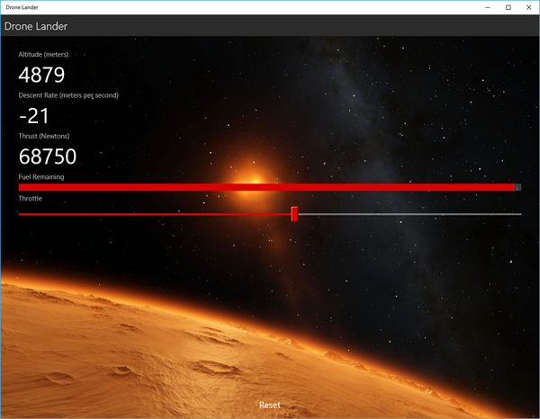
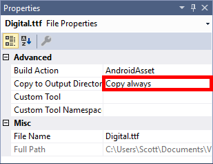
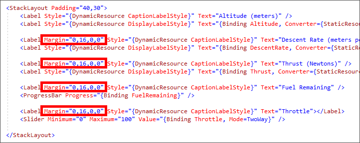
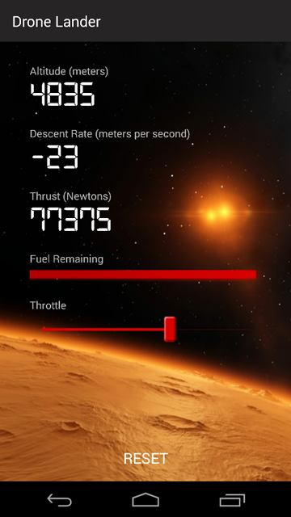
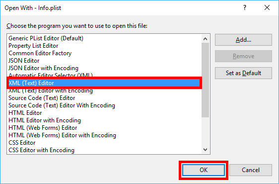
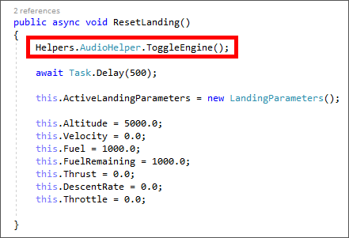
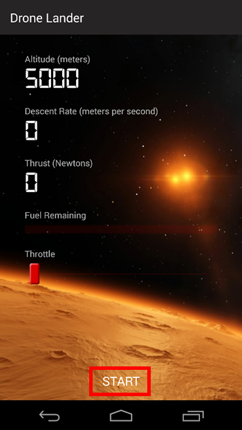
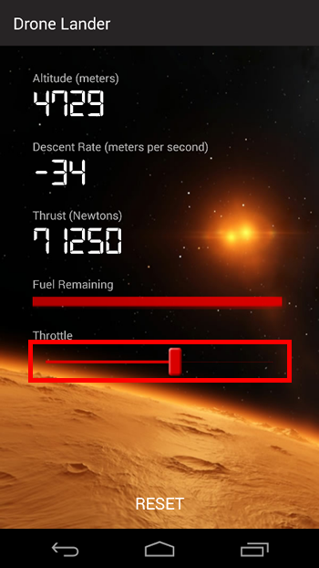

<a name="HOLTitle"></a>
# Operation Remote Resupply, Part 2 #

---

<a name="Overview"></a>
## Overview ##

In Part 1, you built a Xamarin Forms Drone Lander application that achieved 100% sharing of code (C#) and UI (XAML). In the real world, it's rarely that simple. Almost every application requires some platform-specific code in order to customize the UI for individual platforms or leverage features of those platforms that aren't exposed through Xamarin. 

Xamarin Forms supports several techniques for implementing per-platform features. [Dependency services](https://developer.xamarin.com/guides/xamarin-forms/application-fundamentals/dependency-service/) allow platform-specific services such as location APIs and text-to-speech APIs to be called through a common interface defined in shared code. [Custom renderers](https://developer.xamarin.com/guides/xamarin-forms/application-fundamentals/custom-renderer/) allow deep customization of Xamarin Forms controls. [Effects](https://developer.xamarin.com/guides/xamarin-forms/application-fundamentals/effects/) also facilitate control customization, but without many of the complications of custom renderers.

In this lab, you will modify the app you built in Part 1 by customizing the ```ProgressBar``` control that represents the fuel gauge and the ```Slider``` control used for the throttle. You will also add sounds to the app so users receive audible feedback as they attempt to land the drone. Along the way, you will get a first-hand look at dependency services, custom renderers, and custom effects, and learn how to write them as well as when to apply them.

<a name="Objectives"></a>
### Objectives ###

In this lab, you will learn how to:

- Use custom renderers to customize Xamarin Forms controls
- Use custom effects to apply custom fonts to Xamarin Forms controls
- Use a dependency service to play audio in Xamarin Forms apps

<a name="Prerequisites"></a>
### Prerequisites ###

The following are required to complete this lab:

- [Visual Studio Community 2017](https://www.visualstudio.com/vs/) or higher
- A computer running Windows 10 that supports hardware emulation using Hyper-V. For more information, and for a list of requirements, see https://msdn.microsoft.com/en-us/library/mt228280.aspx. 

---

<a name="Exercises"></a>
## Exercises ##

This lab includes the following exercises:

- [Exercise 1: Add custom renderers](#Exercise1)
- [Exercise 2: Add a custom effect](#Exercise2)
- [Exercise 3: Add a dependency service](#Exercise3)
- [Exercise 4: Call the dependency service from shared code](#Exercise3)
- [Exercise 5: Test the updated app](#Exercise5) 
 
Estimated time to complete this lab: **45** minutes.

<a name="Exercise1"></a>
## Exercise 1: Add custom renderers ##

One of the remarkable aspects of Xamarin Forms is that you declare controls in XAML that is shared between platforms, but at run-time, Xamarin Forms emits controls that are native to the host platform. For example, a ```Button``` control declared in XAML becomes a native ```Button``` control on Windows and Android and a ```UIButton``` on iOS. This feat is accomplished using *renderers* that create native controls from Xamarin Forms controls.

Each control in Xamarin Forms is accompanied by a renderer whose job is to "project" the control into the UI by instantiating a native control. You can change the look and behavior of these controls by replacing the built-in renderers with renderers of your own, known as *custom renderers*. For a great overview of how custom renderers work and how they're written, see [Supercharging Xamarin Forms with Custom Renderers](http://www.wintellect.com/devcenter/jprosise/supercharging-xamarin-forms-with-custom-renderers-part-1).

In this exercise, you will write custom renderers for all three platforms to customize the fuel gauge and the throttle control. Such customizations are common in Xamarin Forms applications and knowing how to perform them is a crucial step in becoming a skilled Xamarin Forms developer.

1. In Visual Studio 2017, open the **Drone Lander** solution created in the previous lab.

1. Right-click the **DroneLander.Android** project in Solution Explorer and use the **Add** > **New Folder** command to add a folder named "Renderers" to the project.

1. Right-click the "Renderers" folder and use the **Add** > **Class** command to add a class file named "FuelControlRenderer.cs." Then replace the contents of the file with the following code:
 
	```C#
	using System;
	using System.Collections.Generic;
	using System.Linq;
	using System.Text;
	
	using Android.App;
	using Android.Content;
	using Android.OS;
	using Android.Runtime;
	using Android.Views;
	using Android.Widget;
	
	using Xamarin.Forms.Platform.Android;
	using Xamarin.Forms;
	using Android.Graphics;
	using DroneLander.Droid.Renderers;
	
	[assembly: ExportRenderer(typeof(Xamarin.Forms.ProgressBar), typeof(FuelControlRenderer))]
	namespace DroneLander.Droid.Renderers
	{
	    public class FuelControlRenderer : ProgressBarRenderer
	    {
	        protected override void OnElementChanged(ElementChangedEventArgs<Xamarin.Forms.ProgressBar> e)
	        {
	            base.OnElementChanged(e);
	
	            if (Control != null)
	            {
	                Control.ScaleY = 4.0f;
	                Control.ProgressDrawable.SetColorFilter(Android.Graphics.Color.Rgb(217, 0, 0), PorterDuff.Mode.SrcIn);
	            }
	        }
	    }
	}
	``` 

	Thanks to the ```ExportRenderer``` attribute, this class will now be used to render ```ProgressBar``` controls in the Android version of the app. The ```OnElementChanged``` method is called by Xamarin Forms to allow the renderer to the create the control. Calling the base class's implementation of that method allows the default renderer to create the native control and assign a reference to the renderer's ```Control``` property. After that, the renderer can modify the control as needed. In this case, the renderer modifies two properties of the native Android ```ProgressBar``` control to increase its thickness and change its color to red.

1. Once more, right-click the "Renderers" folder and use the **Add** > **Class** command to add a class file named "ThrottleControlRenderer.cs." Then replace the contents of the file with the following code:

	```C#
	using System;
	using System.Collections.Generic;
	using System.Linq;
	using System.Text;
	
	using Android.App;
	using Android.Content;
	using Android.OS;
	using Android.Runtime;
	using Android.Views;
	using Android.Widget;
	
	using Xamarin.Forms.Platform.Android;
	using Xamarin.Forms;
	using Android.Graphics;
	using DroneLander.Droid.Renderers;
	using Android.Graphics.Drawables;
	using Android.Support.V4.Content;
	
	[assembly: ExportRenderer(typeof(Slider), typeof(ThrottleControlRenderer))]
	namespace DroneLander.Droid.Renderers
	{
	    public class ThrottleControlRenderer : SliderRenderer
	    {
	        protected override void OnElementChanged(ElementChangedEventArgs<Slider> e)
	        {
	            base.OnElementChanged(e);
	
	            if (Control != null)
	            {	                
	                Control.ProgressDrawable.SetColorFilter(Android.Graphics.Color.Rgb(217, 0, 0), PorterDuff.Mode.SrcIn);
	                Drawable myThumb = ContextCompat.GetDrawable(Context, Resource.Drawable.throttle_thumb);
	                Control.SetThumb(myThumb);
	            }
	        }
	    }
	}
	```

1. The modified throttle control uses a custom image as the selector thumb. That image needs to be added to the project. In Solution Explorer, right-click the "Resources/drawable" folder in the **DroneLander.Android** project and use the **Add** > **Existing Item...** command to import **throttle_thumb.png** from the lab's "Resources\Renderers" folder.

1. Ensure that the Android project is selected as the startup project by right-clicking the **DroneLander.Android** project in Solution Explorer and selecting **Set as StartUp Project**.

1. Click the **Run** button (the one with the green arrow) at the top of Visual Studio to launch the Android version of Drone Lander in the selected Android emulator. Note that the emulator will probably take a minute or two to start if it isn't already running.
  
    

    _Launching Drone Lander on Android_

1. Confirm that the ```ProgressBar``` and ```Slider``` controls used for the fuel gauge and throttle, respectively, resemble the ones below. (Don't worry about the vertical spacing between controls for the moment; you will attend to that later.) When you're done, use Visual Studio's **Debug** > **Stop Debugging** command to terminate the app.
  
    

    _The Android app with customized controls_

1. Now let's modify the iOS version of the app to use custom renderers, too. (You won't be building the iOS project in this lab, but in case you build it later, you want the iOS app to look as good as the Android app.) In Solution Explorer, right-click the **DroneLander.iOS** project and use the **Add** > **New Folder** command to add a folder named "Renderers" to the project.

1. Right-click the "Renderers" folder and use the **Add** > **Class** command to add a class file named "FuelControlRenderer.cs." Then replace the contents of the file with the following code:

	```C#
	using System;
	using System.Collections.Generic;
	using System.Linq;
	using System.Text;
	
	using Xamarin.Forms.Platform.iOS;
	using Xamarin.Forms;
	
	using DroneLander.iOS.Renderers;
	using UIKit;
	using CoreGraphics;
	
	[assembly: ExportRenderer(typeof(ProgressBar), typeof(FuelControlRenderer))]
	namespace DroneLander.iOS.Renderers
	{
	    public class FuelControlRenderer : ProgressBarRenderer
	    {
	        protected override void OnElementChanged(ElementChangedEventArgs<ProgressBar> e)
	        {
	            base.OnElementChanged(e);
	
	            if (Control != null)
	            {
	                Control.TintColor = UIColor.FromRGB(217, 0, 0);
	            }
	        }
	
	        public override void LayoutSubviews()
	        {
	            base.LayoutSubviews();
	
	            var X = 1.0f;
	            var Y = 4.0f;
	
	            CGAffineTransform transform = CGAffineTransform.MakeScale(X, Y);
	            Control.Transform = transform;
	        }
	    }
	}
	```

1. Once more, right-click the "Renderers" folder and use the **Add** > **Class** command to add a class file named "ThrottleControlRenderer.cs." Then replace the contents of the file with the following code:

	```C#
	using System;
	using System.Collections.Generic;
	using System.Linq;
	using System.Text;
	
	using Xamarin.Forms.Platform.iOS;
	using Xamarin.Forms;
	
	using DroneLander.iOS.Renderers;
	using UIKit;
	using CoreGraphics;
	
	[assembly: ExportRenderer(typeof(Slider), typeof(ThrottleControlRenderer))]
	namespace DroneLander.iOS.Renderers
	{
	    public class ThrottleControlRenderer : SliderRenderer
	    {
	        protected override void OnElementChanged(ElementChangedEventArgs<Slider> e)
	        {
	            base.OnElementChanged(e);
	
	            if (Control != null)
	            {
	                Control.SetThumbImage(UIImage.FromFile("throttle_thumb.png"), UIControlState.Normal);
	                Control.TintColor = UIColor.FromRGB(217, 0, 0);
	            }
	        }
	    }
	}
	```

1. Right-click the "Resources" folder in the **DroneLander.iOS** project and use the **Add** > **Existing Item...** command to import **throttle_thumb.png** from the lab's "Resources\Renderers" folder. This completes the modifications for the iOS version of the app.

1. Now let's update the Windows project to use custom renderers. In Solution Explorer, right-click the **DroneLander.UWP** project and use the **Add** > **New Folder** command to add a folder named "Renderers" to the project.

1. Right-click the "Renderers" folder and use the **Add** > **Class** command to add a class file named "FuelControlRenderer.cs." Then replace the contents of the file with the following code:

	```C#
	using DroneLander.UWP.Renderers;
	using System;
	using System.Collections.Generic;
	using System.Linq;
	using System.Text;
	using System.Threading.Tasks;
	using Windows.UI.Xaml.Media;
	using Xamarin.Forms;
	using Xamarin.Forms.Platform.UWP;
	
	[assembly: ExportRenderer(typeof(ProgressBar), typeof(FuelControlRenderer))]
	namespace DroneLander.UWP.Renderers
	{
	    public class FuelControlRenderer : ProgressBarRenderer
	    {
	        protected override void OnElementChanged(ElementChangedEventArgs<ProgressBar> e)
	        {
	            base.OnElementChanged(e);
	
	            if (Control != null)
	            {
	                Control.Height = 16;
	                Control.Foreground = new SolidColorBrush(Windows.UI.Color.FromArgb(255, 217, 0, 0));
	            }
	        }
	    }
	}
	```

1. Once more, right-click the "Renderers" folder and use the **Add** > **Class** command to add a class file named "ThrottleControlRenderer.cs." Then replace the contents of the file with the following code:

	```C#
	using DroneLander.UWP.Renderers;
	using System;
	using System.Collections.Generic;
	using System.Linq;
	using System.Text;
	using System.Threading.Tasks;
	using Windows.UI.Xaml.Media;
	using Xamarin.Forms;
	using Xamarin.Forms.Platform.UWP;
	
	[assembly: ExportRenderer(typeof(Slider), typeof(ThrottleControlRenderer))]
	namespace DroneLander.UWP.Renderers
	{
	    public class ThrottleControlRenderer : SliderRenderer
	    {
	        protected override void OnElementChanged(ElementChangedEventArgs<Slider> e)
	        {
	            base.OnElementChanged(e);
	
	            if (Control != null)
	            {
	                Control.Style = (Windows.UI.Xaml.Style)App.Current.Resources["KnobSliderStyle"];
	            }
	        }
	    }
	}
	```

1. Right-click the "Assets" folder in the **DroneLander.UWP** project and use the **Add** > **Existing Item...** command to import **throttle_thumb.png** from the lab's "Resources\Renderers" folder.

1. Still in the **DroneLander.UWP** project, open **App.xaml** and replace the contents of the file with the following XAML to define the color, brush, and style resources used by the throttle control:

	```Xaml
	<Application
    x:Class="DroneLander.UWP.App"
    xmlns="http://schemas.microsoft.com/winfx/2006/xaml/presentation"
    xmlns:x="http://schemas.microsoft.com/winfx/2006/xaml"
    xmlns:local="using:DroneLander.UWP"
    RequestedTheme="Dark">

    <Application.Resources>
        <ResourceDictionary>
            <Color x:Key="AppMainAccentColor">#FFD90000</Color>
            <SolidColorBrush x:Key="AppMainAccentBrush" Color="{ThemeResource AppMainAccentColor}"/>
            <SolidColorBrush x:Key="SliderTrackValueFillPointerOver" Color="{ThemeResource AppMainAccentColor}"/>
            <SolidColorBrush x:Key="SliderTrackValueFillPressed" Color="{ThemeResource AppMainAccentColor}"/>

            <x:Double x:Key="SliderOutsideTickBarThemeHeight">8</x:Double>
            <x:Double x:Key="SliderTrackThemeHeight">4</x:Double>

            <Style x:Key="KnobSliderStyle" TargetType="Slider">
                <Setter Property="Background" Value="{ThemeResource SliderTrackFill}"/>
                <Setter Property="BorderThickness" Value="{ThemeResource SliderBorderThemeThickness}"/>
                <Setter Property="Foreground" Value="{ThemeResource AppMainAccentBrush}"/>
                <Setter Property="FontFamily" Value="{ThemeResource ContentControlThemeFontFamily}"/>
                <Setter Property="FontSize" Value="{ThemeResource ControlContentThemeFontSize}"/>
                <Setter Property="ManipulationMode" Value="None"/>
                <Setter Property="UseSystemFocusVisuals" Value="True"/>
                <Setter Property="Template">
                    <Setter.Value>
                        <ControlTemplate TargetType="Slider">
                            <Grid Margin="{TemplateBinding Padding}">
                                <Grid.Resources>
                                    <Style x:Key="SliderThumbStyle" TargetType="Thumb">
                                        <Setter Property="BorderThickness" Value="0"/>
                                        <Setter Property="Background" Value="{ThemeResource SliderThumbBackground}"/>
                                        <Setter Property="Template">
                                            <Setter.Value>
                                                <ControlTemplate TargetType="Thumb">
                                                    <Border BorderBrush="{TemplateBinding BorderBrush}" BorderThickness="{TemplateBinding BorderThickness}" Background="Transparent" CornerRadius="0">
                                                        <Image Stretch="Fill" Source="ms-appx://DroneLander.UWP/Assets/throttle_thumb.png" Width="16" Height="34"/>
                                                    </Border>
                                                </ControlTemplate>
                                            </Setter.Value>
                                        </Setter>
                                    </Style>
                                </Grid.Resources>
                                <Grid.RowDefinitions>
                                    <RowDefinition Height="Auto"/>
                                    <RowDefinition Height="*"/>
                                </Grid.RowDefinitions>
                                <VisualStateManager.VisualStateGroups>
                                    <VisualStateGroup x:Name="CommonStates">
                                        <VisualState x:Name="Normal"/>
                                        <VisualState x:Name="Pressed">
                                            <Storyboard>
                                                <ObjectAnimationUsingKeyFrames Storyboard.TargetProperty="Fill" Storyboard.TargetName="HorizontalTrackRect">
                                                    <DiscreteObjectKeyFrame KeyTime="0" Value="{ThemeResource SliderTrackFillPressed}"/>
                                                </ObjectAnimationUsingKeyFrames>
                                                <ObjectAnimationUsingKeyFrames Storyboard.TargetProperty="Fill" Storyboard.TargetName="VerticalTrackRect">
                                                    <DiscreteObjectKeyFrame KeyTime="0" Value="{ThemeResource SliderTrackFillPressed}"/>
                                                </ObjectAnimationUsingKeyFrames>
                                                <ObjectAnimationUsingKeyFrames Storyboard.TargetProperty="Background" Storyboard.TargetName="HorizontalThumb">
                                                    <DiscreteObjectKeyFrame KeyTime="0" Value="{ThemeResource SliderThumbBackgroundPressed}"/>
                                                </ObjectAnimationUsingKeyFrames>
                                                <ObjectAnimationUsingKeyFrames Storyboard.TargetProperty="Background" Storyboard.TargetName="VerticalThumb">
                                                    <DiscreteObjectKeyFrame KeyTime="0" Value="{ThemeResource SliderThumbBackgroundPressed}"/>
                                                </ObjectAnimationUsingKeyFrames>
                                                <ObjectAnimationUsingKeyFrames Storyboard.TargetProperty="Background" Storyboard.TargetName="SliderContainer">
                                                    <DiscreteObjectKeyFrame KeyTime="0" Value="{ThemeResource SliderContainerBackgroundPressed}"/>
                                                </ObjectAnimationUsingKeyFrames>
                                                <ObjectAnimationUsingKeyFrames Storyboard.TargetProperty="Fill" Storyboard.TargetName="HorizontalDecreaseRect">
                                                    <DiscreteObjectKeyFrame KeyTime="0" Value="{ThemeResource SliderTrackValueFillPressed}"/>
                                                </ObjectAnimationUsingKeyFrames>
                                                <ObjectAnimationUsingKeyFrames Storyboard.TargetProperty="Fill" Storyboard.TargetName="VerticalDecreaseRect">
                                                    <DiscreteObjectKeyFrame KeyTime="0" Value="{ThemeResource SliderTrackValueFillPressed}"/>
                                                </ObjectAnimationUsingKeyFrames>
                                            </Storyboard>
                                        </VisualState>
                                        <VisualState x:Name="Disabled">
                                            <Storyboard>
                                                <ObjectAnimationUsingKeyFrames Storyboard.TargetProperty="Foreground" Storyboard.TargetName="HeaderContentPresenter">
                                                    <DiscreteObjectKeyFrame KeyTime="0" Value="{ThemeResource SliderHeaderForegroundDisabled}"/>
                                                </ObjectAnimationUsingKeyFrames>
                                                <ObjectAnimationUsingKeyFrames Storyboard.TargetProperty="Fill" Storyboard.TargetName="HorizontalDecreaseRect">
                                                    <DiscreteObjectKeyFrame KeyTime="0" Value="{ThemeResource SliderTrackValueFillDisabled}"/>
                                                </ObjectAnimationUsingKeyFrames>
                                                <ObjectAnimationUsingKeyFrames Storyboard.TargetProperty="Fill" Storyboard.TargetName="HorizontalTrackRect">
                                                    <DiscreteObjectKeyFrame KeyTime="0" Value="{ThemeResource SliderTrackFillDisabled}"/>
                                                </ObjectAnimationUsingKeyFrames>
                                                <ObjectAnimationUsingKeyFrames Storyboard.TargetProperty="Fill" Storyboard.TargetName="VerticalDecreaseRect">
                                                    <DiscreteObjectKeyFrame KeyTime="0" Value="{ThemeResource SliderTrackValueFillDisabled}"/>
                                                </ObjectAnimationUsingKeyFrames>
                                                <ObjectAnimationUsingKeyFrames Storyboard.TargetProperty="Fill" Storyboard.TargetName="VerticalTrackRect">
                                                    <DiscreteObjectKeyFrame KeyTime="0" Value="{ThemeResource SliderTrackFillDisabled}"/>
                                                </ObjectAnimationUsingKeyFrames>
                                                <ObjectAnimationUsingKeyFrames Storyboard.TargetProperty="Background" Storyboard.TargetName="HorizontalThumb">
                                                    <DiscreteObjectKeyFrame KeyTime="0" Value="{ThemeResource SliderThumbBackgroundDisabled}"/>
                                                </ObjectAnimationUsingKeyFrames>
                                                <ObjectAnimationUsingKeyFrames Storyboard.TargetProperty="Background" Storyboard.TargetName="VerticalThumb">
                                                    <DiscreteObjectKeyFrame KeyTime="0" Value="{ThemeResource SliderThumbBackgroundDisabled}"/>
                                                </ObjectAnimationUsingKeyFrames>
                                                <ObjectAnimationUsingKeyFrames Storyboard.TargetProperty="Fill" Storyboard.TargetName="TopTickBar">
                                                    <DiscreteObjectKeyFrame KeyTime="0" Value="{ThemeResource SliderTickBarFillDisabled}"/>
                                                </ObjectAnimationUsingKeyFrames>
                                                <ObjectAnimationUsingKeyFrames Storyboard.TargetProperty="Fill" Storyboard.TargetName="BottomTickBar">
                                                    <DiscreteObjectKeyFrame KeyTime="0" Value="{ThemeResource SliderTickBarFillDisabled}"/>
                                                </ObjectAnimationUsingKeyFrames>
                                                <ObjectAnimationUsingKeyFrames Storyboard.TargetProperty="Fill" Storyboard.TargetName="LeftTickBar">
                                                    <DiscreteObjectKeyFrame KeyTime="0" Value="{ThemeResource SliderTickBarFillDisabled}"/>
                                                </ObjectAnimationUsingKeyFrames>
                                                <ObjectAnimationUsingKeyFrames Storyboard.TargetProperty="Fill" Storyboard.TargetName="RightTickBar">
                                                    <DiscreteObjectKeyFrame KeyTime="0" Value="{ThemeResource SliderTickBarFillDisabled}"/>
                                                </ObjectAnimationUsingKeyFrames>
                                                <ObjectAnimationUsingKeyFrames Storyboard.TargetProperty="Background" Storyboard.TargetName="SliderContainer">
                                                    <DiscreteObjectKeyFrame KeyTime="0" Value="{ThemeResource SliderContainerBackgroundDisabled}"/>
                                                </ObjectAnimationUsingKeyFrames>
                                            </Storyboard>
                                        </VisualState>
                                        <VisualState x:Name="PointerOver">
                                            <Storyboard>
                                                <ObjectAnimationUsingKeyFrames Storyboard.TargetProperty="Fill" Storyboard.TargetName="HorizontalTrackRect">
                                                    <DiscreteObjectKeyFrame KeyTime="0" Value="{ThemeResource SliderTrackFillPointerOver}"/>
                                                </ObjectAnimationUsingKeyFrames>
                                                <ObjectAnimationUsingKeyFrames Storyboard.TargetProperty="Fill" Storyboard.TargetName="VerticalTrackRect">
                                                    <DiscreteObjectKeyFrame KeyTime="0" Value="{ThemeResource SliderTrackFillPointerOver}"/>
                                                </ObjectAnimationUsingKeyFrames>
                                                <ObjectAnimationUsingKeyFrames Storyboard.TargetProperty="Background" Storyboard.TargetName="HorizontalThumb">
                                                    <DiscreteObjectKeyFrame KeyTime="0" Value="{ThemeResource SliderThumbBackgroundPointerOver}"/>
                                                </ObjectAnimationUsingKeyFrames>
                                                <ObjectAnimationUsingKeyFrames Storyboard.TargetProperty="Background" Storyboard.TargetName="VerticalThumb">
                                                    <DiscreteObjectKeyFrame KeyTime="0" Value="{ThemeResource SliderThumbBackgroundPointerOver}"/>
                                                </ObjectAnimationUsingKeyFrames>
                                                <ObjectAnimationUsingKeyFrames Storyboard.TargetProperty="Background" Storyboard.TargetName="SliderContainer">
                                                    <DiscreteObjectKeyFrame KeyTime="0" Value="{ThemeResource SliderContainerBackgroundPointerOver}"/>
                                                </ObjectAnimationUsingKeyFrames>
                                                <ObjectAnimationUsingKeyFrames Storyboard.TargetProperty="Fill" Storyboard.TargetName="HorizontalDecreaseRect">
                                                    <DiscreteObjectKeyFrame KeyTime="0" Value="{ThemeResource SliderTrackValueFillPointerOver}"/>
                                                </ObjectAnimationUsingKeyFrames>
                                                <ObjectAnimationUsingKeyFrames Storyboard.TargetProperty="Fill" Storyboard.TargetName="VerticalDecreaseRect">
                                                    <DiscreteObjectKeyFrame KeyTime="0" Value="{ThemeResource SliderTrackValueFillPointerOver}"/>
                                                </ObjectAnimationUsingKeyFrames>
                                            </Storyboard>
                                        </VisualState>
                                    </VisualStateGroup>
                                    <VisualStateGroup x:Name="FocusEngagementStates">
                                        <VisualState x:Name="FocusDisengaged"/>
                                        <VisualState x:Name="FocusEngagedHorizontal">
                                            <Storyboard>
                                                <ObjectAnimationUsingKeyFrames Storyboard.TargetProperty="(Control.IsTemplateFocusTarget)" Storyboard.TargetName="SliderContainer">
                                                    <DiscreteObjectKeyFrame KeyTime="0" Value="False"/>
                                                </ObjectAnimationUsingKeyFrames>
                                                <ObjectAnimationUsingKeyFrames Storyboard.TargetProperty="(Control.IsTemplateFocusTarget)" Storyboard.TargetName="HorizontalThumb">
                                                    <DiscreteObjectKeyFrame KeyTime="0" Value="True"/>
                                                </ObjectAnimationUsingKeyFrames>
                                            </Storyboard>
                                        </VisualState>
                                        <VisualState x:Name="FocusEngagedVertical">
                                            <Storyboard>
                                                <ObjectAnimationUsingKeyFrames Storyboard.TargetProperty="(Control.IsTemplateFocusTarget)" Storyboard.TargetName="SliderContainer">
                                                    <DiscreteObjectKeyFrame KeyTime="0" Value="False"/>
                                                </ObjectAnimationUsingKeyFrames>
                                                <ObjectAnimationUsingKeyFrames Storyboard.TargetProperty="(Control.IsTemplateFocusTarget)" Storyboard.TargetName="VerticalThumb">
                                                    <DiscreteObjectKeyFrame KeyTime="0" Value="True"/>
                                                </ObjectAnimationUsingKeyFrames>
                                            </Storyboard>
                                        </VisualState>
                                    </VisualStateGroup>
                                </VisualStateManager.VisualStateGroups>
                                <ContentPresenter x:Name="HeaderContentPresenter" ContentTemplate="{TemplateBinding HeaderTemplate}" Content="{TemplateBinding Header}" Foreground="{ThemeResource SliderHeaderForeground}" FontWeight="{ThemeResource SliderHeaderThemeFontWeight}" Margin="{ThemeResource SliderHeaderThemeMargin}" TextWrapping="Wrap" Visibility="Collapsed" x:DeferLoadStrategy="Lazy"/>
                                <Grid x:Name="SliderContainer" Background="{ThemeResource SliderContainerBackground}" Control.IsTemplateFocusTarget="True" Grid.Row="1">
                                    <Grid x:Name="HorizontalTemplate" MinHeight="44">
                                        <Grid.ColumnDefinitions>
                                            <ColumnDefinition Width="Auto"/>
                                            <ColumnDefinition Width="Auto"/>
                                            <ColumnDefinition Width="*"/>
                                        </Grid.ColumnDefinitions>
                                        <Grid.RowDefinitions>
                                            <RowDefinition Height="18"/>
                                            <RowDefinition Height="Auto"/>
                                            <RowDefinition Height="18"/>
                                        </Grid.RowDefinitions>
                                        <Rectangle x:Name="HorizontalTrackRect" Grid.ColumnSpan="3" Fill="{TemplateBinding Background}" Height="{ThemeResource SliderTrackThemeHeight}" Grid.Row="1"/>
                                        <Rectangle x:Name="HorizontalDecreaseRect" Fill="{ThemeResource AppMainAccentBrush}" Grid.Row="1"/>
                                        <TickBar x:Name="TopTickBar" Grid.ColumnSpan="3" Fill="{ThemeResource SliderTickBarFill}" Height="{ThemeResource SliderOutsideTickBarThemeHeight}" Margin="0,0,0,4" Visibility="Collapsed" VerticalAlignment="Bottom"/>
                                        <TickBar x:Name="HorizontalInlineTickBar" Grid.ColumnSpan="3" Fill="{ThemeResource SliderInlineTickBarFill}" Height="{ThemeResource SliderTrackThemeHeight}" Grid.Row="1" Visibility="Collapsed"/>
                                        <TickBar x:Name="BottomTickBar" Grid.ColumnSpan="3" Fill="{ThemeResource SliderTickBarFill}" Height="{ThemeResource SliderOutsideTickBarThemeHeight}" Margin="0,4,0,0" Grid.Row="2" Visibility="Collapsed" VerticalAlignment="Top"/>
                                        <Thumb x:Name="HorizontalThumb" AutomationProperties.AccessibilityView="Raw" Grid.Column="2" DataContext="{TemplateBinding Value}" Height="34" Grid.Row="0" Grid.RowSpan="3" Style="{StaticResource SliderThumbStyle}" Width="16" HorizontalAlignment="Left" Margin="0"/>
                                    </Grid>
                                    <Grid x:Name="VerticalTemplate" MinWidth="44" Visibility="Collapsed">
                                        <Grid.ColumnDefinitions>
                                            <ColumnDefinition Width="18"/>
                                            <ColumnDefinition Width="Auto"/>
                                            <ColumnDefinition Width="18"/>
                                        </Grid.ColumnDefinitions>
                                        <Grid.RowDefinitions>
                                            <RowDefinition Height="*"/>
                                            <RowDefinition Height="Auto"/>
                                            <RowDefinition Height="Auto"/>
                                        </Grid.RowDefinitions>
                                        <Rectangle x:Name="VerticalTrackRect" Grid.Column="1" Fill="{TemplateBinding Background}" Grid.RowSpan="3" Width="{ThemeResource SliderTrackThemeHeight}"/>
                                        <Rectangle x:Name="VerticalDecreaseRect" Grid.Column="1" Fill="{TemplateBinding Foreground}" Grid.Row="2"/>
                                        <TickBar x:Name="LeftTickBar" Fill="{ThemeResource SliderTickBarFill}" HorizontalAlignment="Right" Margin="0,0,4,0" Grid.RowSpan="3" Visibility="Collapsed" Width="{ThemeResource SliderOutsideTickBarThemeHeight}"/>
                                        <TickBar x:Name="VerticalInlineTickBar" Grid.Column="1" Fill="{ThemeResource SliderInlineTickBarFill}" Grid.RowSpan="3" Visibility="Collapsed" Width="{ThemeResource SliderTrackThemeHeight}"/>
                                        <TickBar x:Name="RightTickBar" Grid.Column="2" Fill="{ThemeResource SliderTickBarFill}" HorizontalAlignment="Left" Margin="4,0,0,0" Grid.RowSpan="3" Visibility="Collapsed" Width="{ThemeResource SliderOutsideTickBarThemeHeight}"/>
                                        <Thumb x:Name="VerticalThumb" AutomationProperties.AccessibilityView="Raw" Grid.ColumnSpan="3" Grid.Column="0" DataContext="{TemplateBinding Value}" Height="8" Grid.Row="1" Style="{StaticResource SliderThumbStyle}" Width="24"/>
	                                    </Grid>
	                                </Grid>
	                            </Grid>
	                        </ControlTemplate>
	                    </Setter.Value>
	                </Setter>
	            </Style>
	        </ResourceDictionary>
	    </Application.Resources>
	</Application>
	```

1. Make **DroneLander.UWP** the startup project by right-clicking it and selecting **Set as StartUp Project**. Then click the **Run** button at the top of Visual Studio to launch the UWP version of Drone Lander on the local machine.

	> If you would prefer to run the UWP app in a Windows phone emulator rather than on the desktop, simply select the desired emulator from the drop-down list attached to the **Run** button.
 
    

    _Launching the UWP app_

1. Confirm that the fuel gauge and throttle controls now look like the ones below. Then stop debugging.
  
    

    _The UWP app with customized controls_

The app has now been updated to use custom renderers for Android, iOS and Windows. Custom renderers are one mechanism for customizing the appearance of controls, but they often require a lot of code. If you simply need to tweak the properties of the native controls that the default renderers produce, there is a simpler way to do it. That "simpler way" is custom effects.

<a name="Exercise2"></a>
## Exercise 2: Add a custom effect ##

On iOS and Windows, you can employ custom fonts in ```Label``` controls simply by adding font files to the projects and referencing them in the controls' ```FontFamily``` properties. On Android, it's not that simple. Code is required to load the font, create a ```Typeface``` object from it, and assign it to the control's ```Typeface``` property. A custom effect is the perfect tool for accomplishing this. Effects allow you to customize controls on a per-platform basis without writing full-blown renderers. They are typically simpler than custom renderers, and they can accept parameters as well.

In this exercise, you will update the ```Label``` controls that display altitude, descent rate, and thrust in the Drone Lander app to use a digital font that resembles characters on an LCD display. And to ensure that it works on Android, you will write a custom effect.

1. In Solution Explorer, right-click the **DroneLander (Portable)** project and use the **Add** > **New Folder** command to add a folder named "Effects" to the project.

1. Right-click the "Effects" folder and use the **Add** > **Class** command to add a class file named "DigitalFontEffect.cs." Then replace the contents of the file with the following code: 

	```C#
	using Xamarin.Forms;

	namespace DroneLander
	{
	    public static class DigitalFontEffect
	    {
	        public static readonly BindableProperty FontFileNameProperty = BindableProperty.CreateAttached("FontFileName", typeof(string), typeof(DigitalFontEffect), "", propertyChanged: OnFileNameChanged);

	        public static string GetFontFileName(BindableObject view)
	        {
	            return (string)view.GetValue(FontFileNameProperty);
	        }
	
	        public static void SetFontFileName(BindableObject view, string value)
	        {
	            view.SetValue(FontFileNameProperty, value);
	        }

	        static void OnFileNameChanged(BindableObject bindable, object oldValue, object newValue)
	        {
	            var view = bindable as View;
	            if (view == null)
	            {
	                return;
	            }
	            view.Effects.Add(new FontEffect());
	        }

	        class FontEffect : RoutingEffect
	        {
	            public FontEffect() : base("Xamarin.FontEffect")
	            {
	            }
	        }
	    }
	}
	```

	Including this class in the Portable project enables you to apply a custom effect to any control by decorating it with a ```DigitalFontEffect.FontFileName``` attribute. The implementation of the effect is performed on a per-platform basis.

1. Add a folder named "Effects" to the **DroneLander.Android** project. Then right-click the folder and use the **Add** > **Class** command to add a class file named "DigitalFontEffect.cs." Replace the contents of the file with the following code: 

	```C#
	using System;
	using Xamarin.Forms;
	using Xamarin.Forms.Platform.Android;
	using Android.Widget;
	using Android.Graphics;
	using System.ComponentModel;
	using DroneLander;
	using DroneLander.Droid;
	
	[assembly: ResolutionGroupName("Xamarin")]
	[assembly: ExportEffect(typeof(DroneLander.Droid.DigitalFontEffect), "FontEffect")]
	namespace DroneLander.Droid
	{
	    public class DigitalFontEffect : PlatformEffect
	    {
	        TextView control;
	        protected override void OnAttached()
	        {
	            try
	            {
	                control = Control as TextView;
	                Typeface font = Typeface.CreateFromAsset(Forms.Context.Assets, "Fonts/" + DroneLander.DigitalFontEffect.GetFontFileName(Element) + ".ttf");
	                control.Typeface = font;
	            }
	            catch (Exception ex)
	            {
	            }
	        }
	
	        protected override void OnDetached()
	        {
	        }
	
	        protected override void OnElementPropertyChanged(PropertyChangedEventArgs args)
	        {
	            if (args.PropertyName == DroneLander.DigitalFontEffect.FontFileNameProperty.PropertyName)
	            {
	                Typeface font = Typeface.CreateFromAsset(Forms.Context.ApplicationContext.Assets, "Fonts/" + DroneLander.DigitalFontEffect.GetFontFileName(Element) + ".ttf");
	                control.Typeface = font;
	            }
	        }
	    }
	}
	```

	Custom effects are written by deriving from Xamarin Forms' ```PlatformEffect``` class and overriding key methods such as ```OnAttached```, which is called when the effect is "attached" to the control, and ```OnElementPropertyChanged```, which is called when one of the control's property values changes.

1. Right-click the "Assets" folder in the **DroneLander.Android** project and use the **Add** > **New Folder** command to add a subfolder named "Fonts." Then right-click the "Fonts" folder and use the **Add** > **Existing Item...** command to import **Digital.ttf** from the lab's "Resources\Fonts" folder.

1. Select **Digital.ttf** in Solution Explorer. Then go to the Properties window and set **Copy to Output Directory** to **Copy Always**.

    

    _Updating the properties of Digital.ttf_

1. Open **MainPage.xaml** in the **DroneLander (Portable)** project and add a ```Margin = "0,16,0,0"``` attribute to the four ```Label``` controls highlighted below. This will create a little more vertical space between controls.

    

    _Increasing the space between controls_

1. Now locate the ```Label``` controls that display altitude, descent rate, and thrust, and add the following attribute to each of the three controls to change the control fonts:

	```xaml
	local:DigitalFontEffect.FontFileName="Digital"
	```

1. Launch the Android version of Drone Lander in the Android emulator and confirm that the UI resembles the one below. Note the digital font used for the altitude, descent rate, and thrust readouts, and the increased margin between controls.  

	

    _The updated Android app_

1. Right-click the "Resources" folder in the **DroneLander.iOS** project and use the **Add** > **New Folder** command to add a subfolder named "Fonts." Then right-click the "Fonts" folder and use the **Add** > **Existing Item...** command to import **Digital.ttf** from the lab's "Resources\Fonts" folder.	

1. Select **Digital.ttf** and change its **Copy to Output Directory** property to **Copy Always**.

1. Still in the **DroneLander.iOS** project, right-click **Info.plist**. Select **Open With...** from the context menu, select **XML (Text) Editor**, and click **OK**.
 
    

    _Opening Info.plist in the XML editor_

1. Scroll to the bottom of the file and add the following statements just before the closing ```</dict>``` tag:

	```XML
	<key>UIAppFonts</key>
	<array>
	  <string>Fonts\Digital.ttf</string>
	</array>
	```

1. Right-click the "Assets" folder in the **DroneLander.UWP** project and use the **Add** > **New Folder** command to add a subfolder named "Fonts." Then right-click the "Fonts" folder and use the **Add** > **Existing Item...** command to import **Digital.ttf** from the lab's "Resources\Fonts" folder.	

1. Open **App.xaml** in the **DroneLander (Portable)** project and replace the style named ```DisplayLabelStyle``` with the following style definition:

	```Xaml
	<Style x:Key="DisplayLabelStyle" TargetType="Label">
	    <Setter Property="TextColor" Value="White" />
	    <Setter Property="Margin">
	        <Setter.Value>
	            <OnPlatform x:TypeArguments="Thickness"
	                iOS="0,-10,0,0"
	                Android="0,-5,0,0"
	                WinPhone="0,-5,0,0" />
	        </Setter.Value>
	    </Setter>
	    <Setter Property="FontSize" Value="48" />
	    <Setter Property="FontFamily">
	        <Setter.Value>
	            <OnPlatform x:TypeArguments="x:String">
	                <OnPlatform.iOS>Digital-7Mono</OnPlatform.iOS>
	                <OnPlatform.Android></OnPlatform.Android>
	                <OnPlatform.WinPhone>/Assets/Fonts/Digital.ttf#Digital-7 Mono</OnPlatform.WinPhone>
	            </OnPlatform>
	        </Setter.Value>
	    </Setter>
	</Style>
	```

	The main purpose of this style is to set the ```FontFamily``` property of the controls to which it is applied on iOS and Windows to use the font in **Digital.ttf**. It also ensures that the margins and spacing look great on all three platforms. Note the use of ```OnPlatform```, which is a simple yet powerful way to assign per-platform values to control properties and "tweak" the UI for each different operating system.

1. Launch the Windows version of the app and confirm that the same changes you saw in Android app appear in the Windows version, too.

The primary purpose of custom renderers and custom effects is to change the appearance of controls used in Xamarin Forms apps. But what if you want to call platform-specific code in a Xamarin Forms app — for example, call an API that is unique to iOS, Android, or Windows? That's where dependency services come in. 

<a name="Exercise3"></a>
## Exercise 3: Add a dependency service ##

Xamarin lets you write native apps for iOS, Android, and Windows in C# using a common API that feels familiar to .NET developers. But not all features of these platforms are exposed through Xamarin. A classic example is location services — APIs for detecting a user's current location or tracking movement. iOS, Android, and Windows all include location APIs, but because Xamarin doesn't wrap them, an app that wants to use these APIs must call them directly.

The primary mechanism that Xamarin Forms apps use to call platform-specific APIs is *dependency services*. Dependency services permit you to define an interface in shared code and provide per-platform implementations of that interface in the platform-specific projects. Through the magic of dependency injection, a method called from shared code executes code that is specific to the host operating system. 

In this exercise, you will write a dependency service that enables Drone Lander to produce sound. In [Exercise 4](#Exercise4), you will modify the app to use the dependency service to play engine noises while the lander is descending. 

1. Add a folder named "Services" to the **DroneLander (Portable)** project. Right-click the "Services" folder and use the **Add** > **Class** command to add a class file named "IAudioService.cs." Then replace the contents of the file with the following code:

	```C#
	using System;
	using System.Collections.Generic;
	using System.Linq;
	using System.Text;
	using System.Threading.Tasks;
	
	namespace DroneLander.Services
	{
	    public interface IAudioService
	    {
	        void AdjustVolume(double volume);
	        void KillEngine();
	        void ToggleEngine();
	        Action OnFinishedPlaying { get; set; }
	    }
	}

	```
	
	This code defines an interface named ```IAudioService``` that can be called from shared code but implemented differently in each platform-specific project.

1. Add a folder named "Services" to the **DroneLander.Android** project. Right-click the "Services" folder and use the **Add** > **Class** command to add a class file named "AudioServices.cs." Then replace the contents of the file with the following code, which implements the ```IAudioService``` interface in a way that is specific to Android:

	```C#
	using System;
	using System.Collections.Generic;
	using System.Linq;
	using System.Text;
	using Android.Media;
	using Android.App;
	using Android.Content;
	using Android.OS;
	using Android.Runtime;
	using Android.Views;
	using Android.Widget;
	
	using Xamarin.Forms;
	using DroneLander.Droid.Services;
	using DroneLander.Services;
	
	[assembly: Dependency(typeof(AudioService))]
	namespace DroneLander.Droid.Services
	{
	    public class AudioService : IAudioService
	    {
	        private MediaPlayer _mediaPlayer;
	
	        public Action OnFinishedPlaying { get; set; }
	
	        public AudioService()
	        {
	        }
	
	        public void AdjustVolume(double level)
	        {
	            float volume = (float)(level / 100.0);
	            if (volume == 0.0) volume = 0.1f;
	            _mediaPlayer.SetVolume(volume, volume);
	        }
	
	        public void KillEngine()
	        {    
	            _mediaPlayer?.SetVolume(0.0f, 0.0f);
	        }
	
	        public void ToggleEngine()
	        {
	            if (_mediaPlayer != null)
	            {
	                _mediaPlayer.Completion -= OnMediaCompleted;
	                _mediaPlayer.Stop();
	                _mediaPlayer = null;
	            }
	            else
	            {
	                var fullPath = "Sounds/engine.m4a";
	                Android.Content.Res.AssetFileDescriptor afd = null;
	
	                try
	                {
	                    afd = Forms.Context.Assets.OpenFd(fullPath);
	                }
	                catch (Exception ex)
	                {
	
	                }
	                if (afd != null)
	                {
	                    if (_mediaPlayer == null)
	                    {
	                        _mediaPlayer = new MediaPlayer();
	                        _mediaPlayer.Prepared += (sender, args) =>
	                        {
	                            _mediaPlayer.Start();
	                            _mediaPlayer.Completion += OnMediaCompleted;
	                        };
	                    }
	
	                    _mediaPlayer.Reset();
	                    _mediaPlayer.SetVolume(0.1f, 0.1f);
	                    _mediaPlayer.SetDataSource(afd.FileDescriptor, afd.StartOffset, afd.Length);
	                    _mediaPlayer.PrepareAsync();
	                }
	            }
	        }
	
	        void OnMediaCompleted(object sender, EventArgs e)
	        {
	            OnFinishedPlaying?.Invoke();
	        }	
	    }
	}

	```

1. Add a subfolder named "Sounds" to the "Assets" folder in the **DroneLander.Android** project. Right-click the "Sounds" folder and use the **Add** > **Existing Item...** command to import **engine.m4a** from the lab's "Resources\Sounds" folder. This file contains the engine noise that the app will play.

1. Add a folder named "Services" to the **DroneLander.iOS** project. Right-click the "Services" folder and use the **Add** > **Class** command to add a class file named "AudioServices.cs." Then replace the contents of the file with the following code. This is the iOS implementation of ```IAudioService```:

	```C#
	using System;
	using System.Collections.Generic;
	using System.Linq;
	using System.Text;
	
	using Foundation;
	using UIKit;
	using Xamarin.Forms;
	using AVFoundation;
	using DroneLander.iOS.DependencyServices;
	using DroneLander.Services;
	
	[assembly: Dependency(typeof(AudioService))]
	namespace DroneLander.iOS.DependencyServices
	{
	    public class AudioService : IAudioService
	    {
	        private AVAudioPlayer _audioPlayer = null;
	        public Action OnFinishedPlaying { get; set; }
	
	        public AudioService()
	        {
	            var avSession = AVAudioSession.SharedInstance();
	            avSession.SetCategory(AVAudioSessionCategory.Playback);
	
	            NSError activationError = null;
	            avSession.SetActive(true, out activationError);
	        }
	
	        public void AdjustVolume(double level)
	        {
	            float volume = (float)(level / 100.0);
	
	            if (volume == 0.0) volume = 0.1f;
	
	            _audioPlayer.SetVolume(volume, 0);
	        }
	
	        public void KillEngine()
	        {
	            _audioPlayer.SetVolume(0.0f, 0);
	        }
	
	        public void ToggleEngine()
	        {
	            if (_audioPlayer != null)
	            {
	                _audioPlayer.FinishedPlaying -= OnMediaCompleted;
	                _audioPlayer.Stop();
	                _audioPlayer = null;
	            }
	            else
	            {
	                string localUrl = "Sounds/engine.m4a";
	                _audioPlayer = AVAudioPlayer.FromUrl(NSUrl.FromFilename(localUrl));
	                _audioPlayer.SetVolume(0.1f, 0);
	                _audioPlayer.FinishedPlaying += OnMediaCompleted;
	                _audioPlayer.Play();
	            }
	        }
	
	        private void OnMediaCompleted(object sender, AVStatusEventArgs e)
	        {
	            OnFinishedPlaying?.Invoke();
	        }
	    }
	}
	```

1. Add a subfolder named "Sounds" to the "Resources" folder in the **DroneLander.iOS** project. Right-click the "Sounds" folder and use the **Add** > **Existing Item...** command to import **engine.m4a** from the lab's "Resources\Sounds" folder.	

1. Add a folder named "Services" to the **DroneLander.UWP** project. Right-click the "Services" folder and use the **Add** > **Class** command to add a class file named "AudioServices.cs." Then replace the contents of the file with the following code:

	```C#
	using DroneLander.UWP.DependencyServices;
	using System;
	using System.Collections.Generic;
	using System.Linq;
	using System.Text;
	using System.Threading.Tasks;
	using Windows.Media.Playback;
	using Xamarin.Forms;
	using DroneLander.Services;
	
	[assembly: Dependency(typeof(AudioService))]
	namespace DroneLander.UWP.DependencyServices
	{
	    public class AudioService : IAudioService
	    {
	        private MediaPlayer _mediaPlayer;
	
	        public Action OnFinishedPlaying { get; set; }
	
	        public AudioService()
	        {
	        }
	
	        public void AdjustVolume(double level)
	        {
	            float volume = (float)(level / 100.0);
	
	            _mediaPlayer.Volume = volume;
	        }
	        public void KillEngine()
	        {
	            _mediaPlayer.Volume = 0.0;
	        }
	
	        public void ToggleEngine()
	        {
	            if (_mediaPlayer != null)
	            {
	                _mediaPlayer.Pause();
	
	                var session = _mediaPlayer.PlaybackSession;
	                session.Position = new TimeSpan(0);
	                _mediaPlayer.MediaEnded -= OnMediaEnded;
	
	            }
	            else
	            {
	                var fullPath = "Assets/Sounds/engine.m4a";
	
	                _mediaPlayer = new MediaPlayer();
	                _mediaPlayer.AutoPlay = false;
	                _mediaPlayer.Volume = 0.1f;
	                _mediaPlayer.MediaEnded += OnMediaEnded;
	
	                Uri pathUri = new Uri($"ms-appx:///{fullPath}");
	                _mediaPlayer.Source = Windows.Media.Core.MediaSource.CreateFromUri(pathUri);
	                _mediaPlayer.Play();
	            }	
	        }
	
	        private void OnMediaEnded(MediaPlayer sender, object args)
	        {
	            OnFinishedPlaying?.Invoke();
	        }
	    }
	}
	```

1. Add a subfolder named "Sounds" to the "Assets" folder in the **DroneLander.UWP** project. Right-click the "Sounds" folder and use the **Add** > **Existing Item...** command to import **engine.m4a** from the lab's "Resources\Sounds" folder.	

With the infrastructure in place for generating sounds, the next step is to modify the app to use it.

<a name="Exercise4"></a>
## Exercise 4: Call the dependency service from shared code ##

The final piece of the puzzle is to call the ```IAudioService``` methods that you added in the previous exercise to make engine noises when the drone is descending, and to vary the volume as the throttle setting increases and decreases. Remember that because you're calling a dependency service, you make the calls from shared code, but execute platform-specific code.

1. Add a folder named "Helpers" to the **DroneLander (Portable)** project. Right-click the "Helpers" folder and use the **Add** > **Class** command to add a class file named "AudioHelper.cs." Then replace the contents of the file with the following code: 

	```C#
	using DroneLander.Services;
	using System;
	using System.Collections.Generic;
	using System.Linq;
	using System.Text;
	using System.Threading.Tasks;
	
	namespace DroneLander.Helpers
	{
	    public static class AudioHelper
	    {
	        public static IAudioService AudioPlayer;
	        public static void ToggleEngine()
	        {
	            AudioPlayer = Xamarin.Forms.DependencyService.Get<IAudioService>();	
	            AudioPlayer.ToggleEngine();
	        }
	
	        public static void AdjustVolume(double volume)
	        {
	            AudioPlayer = Xamarin.Forms.DependencyService.Get<IAudioService>();	
	            AudioPlayer.AdjustVolume(volume);
	        }
	
	        public static void KillEngine()
	        {
	            AudioPlayer = Xamarin.Forms.DependencyService.Get<IAudioService>();	
	            AudioPlayer.KillEngine();
	        }
	    }
	}

	```

	Notice the call to ```Xamarin.Forms.DependencyService.Get```. This is how shared code retrieves a reference to an object that provides a platform-specific implementation of the specified interface.

1. Open **MainViewModel.cs** in the "ViewModels" folder and replace the ```StartLanding``` method with the one below:

	```C#
	public void StartLanding()
	{
	    Helpers.AudioHelper.ToggleEngine();
	
	    Device.StartTimer(TimeSpan.FromMilliseconds(Common.CoreConstants.PollingIncrement), () =>
	    {
	        UpdateFlightParameters();
	                         
	        if (this.ActiveLandingParameters.Altitude > 0.0)
	        {
	            Device.BeginInvokeOnMainThread(() =>
	            {
	                this.Altitude = this.ActiveLandingParameters.Altitude;
	                this.DescentRate = this.ActiveLandingParameters.Velocity;
	                this.FuelRemaining = this.ActiveLandingParameters.Fuel / 1000;
	                this.Thrust = this.ActiveLandingParameters.Thrust;
	            });
	
	            if (this.FuelRemaining == 0.0) Helpers.AudioHelper.KillEngine();
	
	            return this.IsActive;
	        }                
	        else
	        {
	            this.ActiveLandingParameters.Altitude = 0.0;
	            this.IsActive = false;
	
	            Device.BeginInvokeOnMainThread(() =>
	            {
	                this.Altitude = this.ActiveLandingParameters.Altitude;
	                this.DescentRate = this.ActiveLandingParameters.Velocity;
	                this.FuelRemaining = this.ActiveLandingParameters.Fuel / 1000;
	                this.Thrust = this.ActiveLandingParameters.Thrust;
	            });
	
	            if (this.ActiveLandingParameters.Velocity > -5.0)
	            {
	                MessagingCenter.Send(this.ActivityPage, "ActivityUpdate", LandingResultType.Landed);
	            }
	            else
	            {
	                MessagingCenter.Send(this.ActivityPage, "ActivityUpdate", LandingResultType.Kaboom);
	            }
	
	            return false;
	        }
	    });
	}
	```
 
	This will ensure that the engine audio starts playing when the **Start** button is tapped, and stops if the lander runs out of fuel.
	 
1. Still in **MainViewModel.cs**, add the following line of code to the ```ResetLanding``` method, making it the first statement in that method:

	```C#
	Helpers.AudioHelper.ToggleEngine();
	```

    

    _The updated ResetLanding method_

1. Now replace the ```Throttle``` property in the ```MainViewModel``` class with the following implementation to adjust the audio volume whenever the throttle setting changes:

	```C#
	private double _throttle;
    public double Throttle
    {
        get { return this._throttle; }
        set
        {
            this.SetProperty(ref this._throttle, value);
            if (this.IsActive && this.FuelRemaining > 0.0) Helpers.AudioHelper.AdjustVolume(value);
        }
    }
	```

Now let's make sure that it works. Time to make a descent!

<a name="Exercise5"></a>
## Exercise 5: Test the updated app ##

The lander will fly no differently than before, but the UI has changed and you should hear the engine now when you use the throttle to control your descent. In this exercise, you will practice flying supply missions (remember, it gets real in Part 5!) and ensure that all the code you added works.

Remember, you begin a descent 5,000 meters above the Mars surface. When you click **Start**, the supply drone begins falling. (The gravity on Mars is weaker than the gravity on Earth, but there is gravity nonetheless.) The goal is still to touch down on the surface with a downward velocity of 5 meters per second or less.

1. Launch the app in the Android emulator and click **Start**. Increase the throttle a bit and confirm that you hear the engine. It should be low but audible. If you don't hear anything, make sure the volume is turned up on your PC.
 
    

    _Starting a descent_
 
1. Increase the throttle and confirm that the audio increases in volume.

    

    _Adjusting the drone's throttle_
 
Continue flying the mission until you reach the surface. If you have time left over, practice landing the drone a few times to prepare yourself for flying real missions later on.

<a name="Summary"></a>
## Summary ##

Dependency services, custom renderers, and custom effects are important tools in a Xamarin Forms developer's toolbox because virtually every real-world Xamarin Forms app requires some per-platform customizations. When you write Xamarin Forms apps of your own, you can use the customizations you made to Drone Lander as a template for those apps, too.